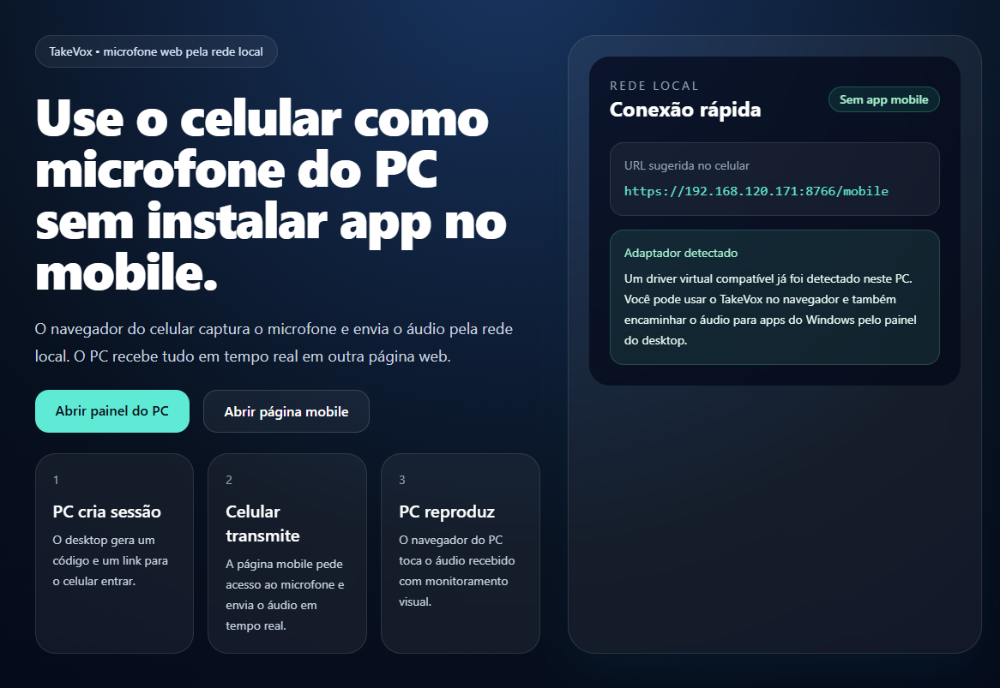
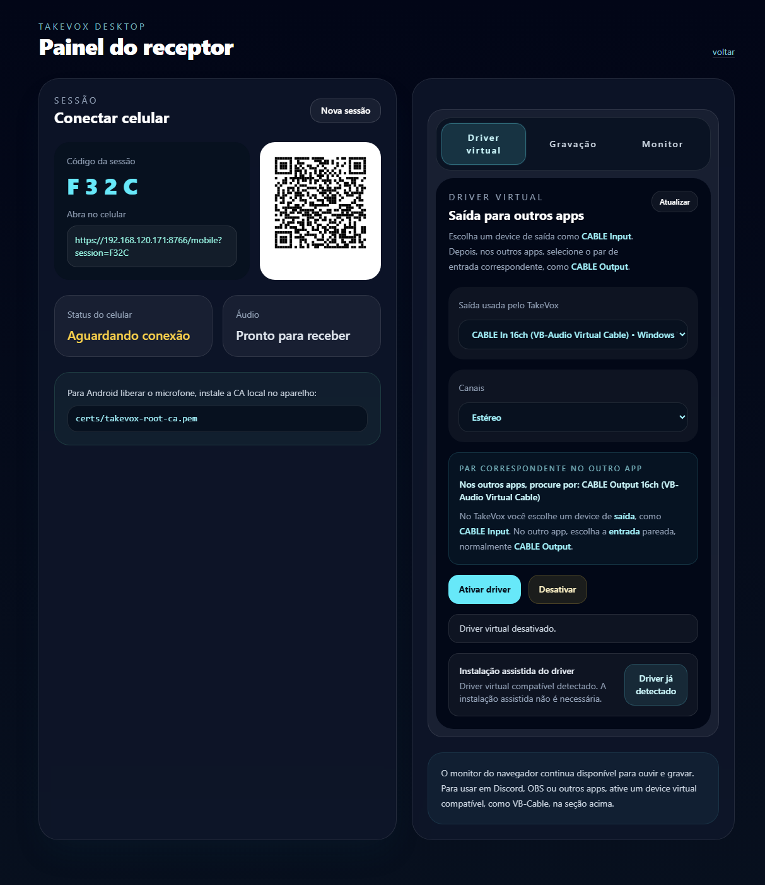
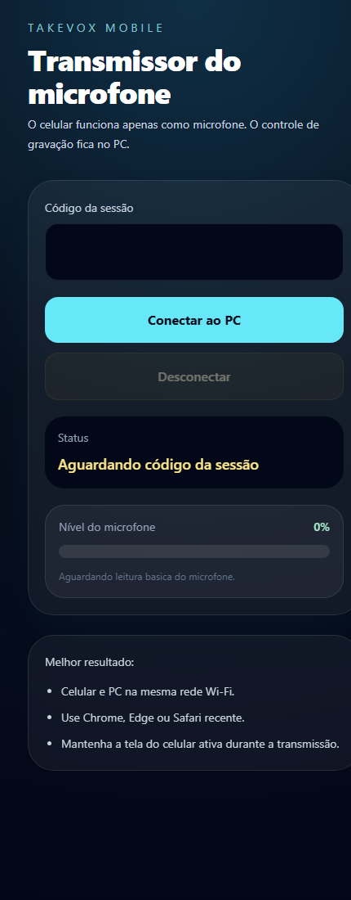

# TakeVox

Protótipo em Python para usar o celular como microfone web do PC sem instalar app no mobile.



## O que faz

- Hospeda uma página desktop para criar a sessão.
- Hospeda uma página mobile para capturar o microfone do celular.
- Envia áudio em tempo real pela rede local via WebSocket.
- Reproduz o áudio recebido no navegador do PC.
- Permite gravar no PC o áudio recebido do celular, ouvir o preview e salvar o arquivo.
- Permite configurar um modelo de nome com `*` e pedir só o número na hora de salvar.
- Permite listar devices de saída do Windows e auto-detectar opções compatíveis com driver virtual.
- Permite rotear o áudio para um driver virtual como VB-Cable para usar em outros apps como microfone nativo.
- Lembra no navegador o último device selecionado e o modo `Mono` ou `Estéreo`.
- Pode baixar o pacote oficial do VB-Cable e abrir a instalação assistida no Windows.

## Limitação importante

Sem instalar nada no celular, o navegador só faz a parte de captura e transmissão. Para o Windows enxergar isso como microfone em Discord, OBS, Zoom ou outros apps, você ainda precisa ter um driver virtual instalado no desktop, como VB-Cable. O TakeVox já consegue enviar o áudio para esse device virtual, mas não cria um driver do zero.

## Instalar Python no Windows

Se o Python ainda não estiver instalado no PC, você pode fazer de duas formas:

Via `winget`:

```powershell
winget install Python.Python.3
```

Depois confirme no terminal:

```powershell
python --version
pip --version
```

Via página oficial:

1. Acesse [python.org/downloads](https://www.python.org/downloads/windows/).
2. Baixe o instalador mais recente do Python 3 para Windows.
3. Na primeira tela do instalador, marque a opção `Add python to PATH`.
4. Clique em `Install Now`.
5. Ao terminar, abra um novo terminal e rode `python --version`.

Se o comando `python` não funcionar depois da instalação, normalmente isso indica que a opção de adicionar ao `PATH` não foi marcada.

## Como rodar

No uso normal, pense assim:

- `setup`: prepara o ambiente e instala as dependências. Normalmente você roda só na primeira vez, ou novamente se apagar a pasta `venv` ou se as dependências mudarem.
- `start`: inicia o TakeVox. Depois que o `setup` já foi feito, este é o comando que você deve usar no dia a dia.

### Windows

Primeira vez:

```bat
setup.bat
start.bat
```

Próximas vezes:

```bat
start.bat
```

### Linux/macOS

Primeira vez:

```sh
./setup.sh
./start.sh
```

Próximas vezes:

```sh
./start.sh
```

### Modo manual

Primeira vez:

```powershell
python -m venv venv
.\venv\Scripts\pip.exe install -r requirements.txt
.\venv\Scripts\python.exe app.py
```

Próximas vezes:

```powershell
.\venv\Scripts\python.exe app.py
```

Na primeira execução, o app gera automaticamente:

- `certs/takevox-root-ca.pem`
- `certs/takevox-root-ca-key.pem`
- `certs/takevox-server-cert.pem`
- `certs/takevox-server-key.pem`

Ao iniciar, o TakeVox tenta abrir automaticamente o painel no navegador padrão.

Depois abra:

- `https://localhost:8765/desktop` no PC
- `https://SEU_IP_LOCAL:8765/mobile` no celular

O próprio painel do desktop também gera um link e um QR code para o celular.

## Configuração

O arquivo [takevox.config.json](/F:/DEV/TakeVox/takevox.config.json) controla a inicialização local.

Exemplo:

```json
{
  "host": "0.0.0.0",
  "port": 8766,
  "scheme": "https",
  "open_browser_on_start": true,
  "desktop_path": "/desktop",
  "driver_download_url": "https://download.vb-audio.com/Download_CABLE/VBCABLE_Driver_Pack45.zip"
}
```

Campos:

- `port`: porta usada pelo servidor HTTPS.
- `host`: host de bind do Uvicorn.
- `scheme`: normalmente `https`.
- `open_browser_on_start`: abre o painel automaticamente no navegador padrão.
- `desktop_path`: rota aberta automaticamente no navegador.
- `driver_download_url`: URL oficial usada para baixar o pacote do driver virtual.

Se a `8765` estiver ocupada, troque só o valor de `port`, por exemplo para `8766`.

## Dependências

Tudo que a aplicação precisa fica no Python. Não é necessário Node.js para gerar o QR code nem para executar a interface.

## Usar como microfone em outros apps

Fluxo recomendado com VB-Cable:

1. Instale um driver virtual no Windows, como [VB-Cable](https://vb-audio.com/Cable/).
2. Rode o TakeVox e conecte o celular.
3. No desktop do TakeVox, na seção `Driver virtual`, escolha um device como `CABLE Input` ou `CABLE In`.
4. Escolha `Mono` ou `Estéreo` e clique em `Ativar driver`.
5. No Discord, OBS, Zoom ou outro app, selecione o device de entrada correspondente, normalmente `CABLE Output`.

Observações:

- O áudio vindo do celular é mono por natureza.
- No modo `Estéreo`, o TakeVox duplica o mesmo sinal nos dois canais para melhorar compatibilidade com alguns devices e apps.
- O painel tenta priorizar automaticamente devices que parecem ser de drivers virtuais compatíveis.

## Instalação assistida do driver

Se o TakeVox não detectar um driver virtual compatível, o painel do desktop mostra o botão `Baixar e instalar driver`.

Esse fluxo faz:

1. Baixa o pacote oficial configurado em `driver_download_url`.
2. Extrai o ZIP em `drivers/vb-cable`.
3. Abre o instalador do VB-Cable com elevação no Windows.

Limites importantes:

- Como é instalação de driver, o Windows ainda pode pedir confirmação de segurança.
- O TakeVox não ignora nem contorna o prompt do sistema.
- Depois da instalação, é recomendável reiniciar o PC.

## Android e certificado

Para o Android liberar o microfone, o certificado precisa ser confiável no aparelho. O fluxo prático fica:

1. Rode o TakeVox no PC.
2. Copie o arquivo [takevox-root-ca.pem](/F:/DEV/TakeVox/certs/takevox-root-ca.pem) para o celular.
3. No Android, instale esse certificado como certificado de CA.
4. Abra `https://IP_DO_PC:PORTA_CONFIGURADA/mobile`.

Se o Android não confiar na CA, a página pode abrir com aviso de segurança e o navegador ainda bloquear o microfone.


## Preview

### Desktop:


### Mobile:

